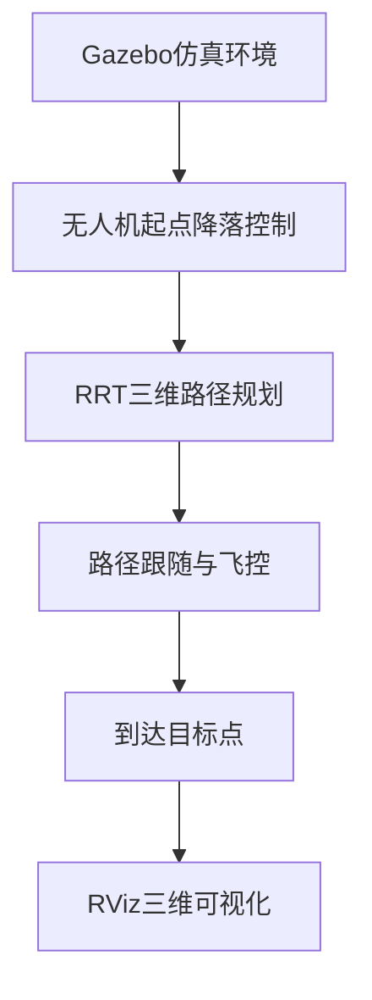

# rotors_simulator 三维无人机仿真与路径规划平台

---

## 目录
- [项目简介与亮点](#项目简介与亮点)
- [应用场景](#应用场景)
- [系统架构总览](#系统架构总览)
- [运行方法](#运行方法)
- [技术细节详解](#技术细节详解)
  - [1. 控制与飞控系统](#1-控制与飞控系统)
  - [2. 三维RRT路径规划](#2-三维rrt路径规划)
  - [3. 可视化与调试](#3-可视化与调试)
- [RViz可视化推荐配置](#rviz可视化推荐配置)
- [常见问题与调试建议](#常见问题与调试建议)
- [主要文件说明](#主要文件说明)
- [致谢与联系方式](#致谢与联系方式)

---

## 项目简介与亮点

本平台基于ROS与Gazebo，面向三维空间的多旋翼无人机仿真、三维避障路径规划与自主飞行控制。支持三维RRT路径规划、三维球体障碍物建模、全自动一键运行、可视化与轨迹分析。

**项目亮点：**
- 真正的三维RRT路径规划与避障
- 三维球体障碍物建模与碰撞检测
- 支持无人机起点降落、路径跟随、飞控仿真全流程
- 一键启动，自动加载RViz可视化配置
- 代码结构清晰，易于二次开发与扩展

---

## 应用场景
- 无人机三维路径规划算法研究与教学
- 多旋翼仿真与飞控算法验证
- 三维环境下的避障与任务规划
- 机器人竞赛、科研论文实验平台

---

## 系统架构总览

本系统由以下核心模块组成：
1. **Gazebo仿真环境**：加载三维障碍物与无人机模型
2. **控制与飞控系统**：无人机起点降落、路径跟随、飞控仿真
3. **三维RRT路径规划**：三维空间采样、避障、路径生成
4. **可视化与调试**：RViz三维展示、轨迹分析

**系统流程图：**


---

## 运行方法

1. **编译工作空间**
   ```bash
   cd ~/catkin_ws
   catkin_make
   source devel/setup.bash
   ```
2. **一键启动全部流程**
   ```bash
   bash run_all.sh
   ```
3. **自动打开RViz**，加载推荐配置文件，观察三维路径、障碍物、无人机轨迹等。

---

## 技术细节详解

### 1. 控制与飞控系统

#### 1.1 起点降落控制（PID）
- 采用三轴PID算法，自动将无人机从初始高度平滑降落到地面起点。
- 主要话题：`/firefly/command/roll_pitch_yawrate_thrust`（姿态+推力控制）
- 支持积分饱和、微分防抖，参数可调。

**PID控制器数学表达式：**

对于每个方向 $i \in \{x, y, z\}$：

$$
\text{error}_i = p_{i,\text{target}} - p_{i,\text{current}}
$$
$$
I_i = I_i + \text{error}_i \cdot dt
$$
$$
D_i = \frac{\text{error}_i - \text{error}_{i,\text{prev}}}{dt}
$$
$$
U_i = K_p^i \cdot \text{error}_i + K_i^i \cdot I_i + K_d^i \cdot D_i
$$

- $U_x, U_y$ 通过坐标变换映射为 roll/pitch 指令
- $U_z$ 直接映射为推力（thrust）

#### 1.2 路径跟随控制
- 逐点发布三维路径点，飞控自动完成位置与姿态控制。
- 主要话题：`/firefly/command/pose`（位置控制）
- 支持动态切换目标点、到达判据、鲁棒性处理。

#### 1.3 飞控系统集成（以本项目Firefly六旋翼无人机为例）

本项目采用Firefly六旋翼无人机模型，飞控通过MAVROS桥接Gazebo与ROS，支持姿态/推力/位置多种控制模式，参数可通过PX4/MAVROS配置。

**Firefly六旋翼无人机动力学与控制数学模型：**

1. **动力学方程**

以六旋翼为例，Firefly无人机的动力学可简化为：

- 位置动力学：
  $$
  \dot{\mathbf{p}} = \mathbf{v}
  $$
  $$
  \dot{\mathbf{v}} = \frac{1}{m}\mathbf{R}(\mathbf{e}_3)f_T - g\mathbf{e}_3
  $$
  其中 $\mathbf{p}$ 为位置，$\mathbf{v}$ 为速度，$m$ 为无人机质量（Firefly约1.6kg），$f_T$ 为总推力，$\mathbf{R}$ 为机体到世界的旋转矩阵，$g=9.8$。

- 姿态动力学：
  $$
  \dot{\mathbf{R}} = \mathbf{R}\hat{\boldsymbol{\omega}}
  $$
  $$
  \mathbf{J}\dot{\boldsymbol{\omega}} = \boldsymbol{\tau} - \boldsymbol{\omega} \times \mathbf{J}\boldsymbol{\omega}
  $$
  其中 $\mathbf{J}$ 为转动惯量，$\boldsymbol{\omega}$ 为角速度，$\boldsymbol{\tau}$ 为总力矩。

2. **推力与力矩分配（Firefly六旋翼）**

Firefly六旋翼的六个电机推力 $f_i$ 与总推力/力矩关系：

$$
\begin{bmatrix} f_T \\ \tau_{\phi} \\ \tau_{\theta} \\ \tau_{\psi} \end{bmatrix} =
A_{6x6}
\begin{bmatrix} f_1 \\ f_2 \\ f_3 \\ f_4 \\ f_5 \\ f_6 \end{bmatrix}
$$

其中 $A_{6x6}$ 为六旋翼推力-力矩分配矩阵。对于120°对称分布的六旋翼（电机编号依次为1~6，逆时针分布），分配矩阵可写为：

$$
A_{6x6} =
\begin{bmatrix}
1 & 1 & 1 & 1 & 1 & 1 \\
0 & l & l & 0 & -l & -l \\
-l & -l/2 & l/2 & l & l/2 & -l/2 \\
c & -c & c & -c & c & -c
\end{bmatrix}
$$

- $l$ 为臂长，$c$ 为力矩系数。
- 每一列对应一个电机对总推力、滚转力矩、俯仰力矩、偏航力矩的贡献。
- 具体参数可查阅Firefly官方文档或六旋翼动力学教材。

与四旋翼相比，六旋翼具有更高的冗余度和抗故障能力，推力分配矩阵更复杂，但原理一致。

3. **飞控控制律**
- 姿态控制：如PD或PID控制器，调节欧拉角/四元数误差。
- 推力分配：将期望推力/力矩分配到六个电机。
- 位置控制：如上层PID，输出期望加速度/推力。

4. **仿真集成说明**
- 高层控制节点输出位置/姿态/推力指令，Firefly飞控根据上述动力学与控制律，计算六个电机转速，通过Gazebo插件驱动无人机模型，实现真实动力学仿真。

### 2. 三维RRT路径规划

#### 2.1 三维采样与扩展
- 路径点为(x, y, z)三元组，采样空间自动适配起终点z范围。
- 最近点查找、扩展、距离判据均为三维欧氏空间。

**三维RRT采样与扩展公式：**

采样点 $(x_{rand}, y_{rand}, z_{rand})$，从最近节点 $(x_{near}, y_{near}, z_{near})$ 沿三维方向扩展步长 $\delta$：

$$
\vec{d} = \frac{(x_{rand}-x_{near},\ y_{rand}-y_{near},\ z_{rand}-z_{near})}{\|\cdot\|}
$$

$$
(x_{new}, y_{new}, z_{new}) = (x_{near}, y_{near}, z_{near}) + \delta \cdot \vec{d}
$$

**三维距离判据：**

$$
d = \sqrt{(x_1-x_2)^2 + (y_1-y_2)^2 + (z_1-z_2)^2}
$$

#### 2.2 三维球体障碍物建模
- 每个障碍物为球心$(x_c, y_c, z_c)$和半径$r$，支持多障碍物。
- 碰撞检测采用三维线段与球体判交，判别式严格。

**三维线段与球体的相交判定公式：**

设线段 $A(x_1, y_1, z_1)$ 到 $B(x_2, y_2, z_2)$，球心 $(x_c, y_c, z_c)$，半径 $r$。

线段参数化为：

$$
(x, y, z) = (x_1, y_1, z_1) + t \cdot (x_2-x_1, y_2-y_1, z_2-z_1),\ t\in[0,1]
$$

判定条件为：

$$
(x-x_c)^2 + (y-y_c)^2 + (z-z_c)^2 = r^2
$$

展开为关于 $t$ 的二次方程，判别式 $\geq 0$ 且 $t\in[0,1]$ 则相交。

#### 2.3 路径平滑与优化
- 支持三维Shortcut Smoothing、B样条等平滑算法。
- 平滑后路径可直接用于无人机跟随，提升飞行效率与安全性。

#### 2.4 参数设置建议
| 参数         | 典型值 | 说明             |
|--------------|--------|------------------|
| step_size    | 1.0    | 路径分辨率       |
| max_iter     | 5000   | 最大采样次数     |
| goal_thresh  | 0.5    | 终点判据         |
| 障碍物半径   | 0.3~0.7| 视仿真环境调整   |

### 3. 可视化与调试

#### 3.1 RViz三维可视化
- 支持三维路径、障碍物球体、无人机模型与轨迹的实时显示。
- 推荐加载`techpod_model_view.rviz`配置文件，自动显示所有核心元素。

#### 3.2 轨迹与性能分析
- 支持三维轨迹、误差、碰撞等多维度分析。
- 可用`hovering_eval.py`、`waypoints_eval.py`等脚本辅助评估。

#### 3.3 常见调试建议
- 检查所有节点和话题是否正常发布。
- 调整RRT参数、障碍物设置，逐步验证三维路径生成。
- 利用RViz的TF、Path、Marker等Display辅助排查问题。

---

## RViz可视化推荐配置

> **建议在RViz中按如下方式添加Display，并选择对应话题：**

| Display类型         | 话题（Topic）                          | 主要作用与可视化效果                         | 推荐设置与说明 |
|---------------------|----------------------------------------|---------------------------------------------|----------------|
| **Fixed Frame**     | `world` 或 `map`                       | 全局参考系，所有显示元素的坐标基准           | 必须与仿真环境frame一致 |
| RobotModel          | Robot Description-->/firefly/robot_description             | 显示Firefly六旋翼三维模型                   | 选择URDF模型，显示link/关节 |
| Path                | `/rrt_path`                            | 显示RRT规划生成的三维路径                   | 线宽2~5，颜色区分路径 |
| Marker/MarkerArray  | `/rrt_markers`                         | 显示RRT起点、终点、障碍物球体等可视化元素   | 颜色区分障碍物/起终点，scale与实际半径一致 |
| Odometry            | `/firefly/odometry_sensor1/odometry`   | 显示无人机实时位置与轨迹                    | 可选Trajectory模式，显示历史轨迹 |
| TF                  | `/tf`                                  | 显示各坐标系变换关系                        | 勾选"Frames"显示树结构 |
| PoseArray（可选）   | `/waypoints`（如有）                   | 显示所有目标点                              | 箭头/球体Marker，颜色区分 |
| PointCloud2（可选） | `/point_cloud`（如有）                 | 显示环境点云（如有传感器仿真）              | 设置点大小、颜色映射 |

### 添加与调整Display的步骤举例
1. **设置Fixed Frame**：在左上角"Global Options"中，将Fixed Frame设为`world`或`map`。
2. **添加RobotModel**：点击"Add"->选择"RobotModel"，显示Firefly六旋翼三维模型。
3. **添加Path**：点击"Add"->选择"Path"，话题选`/rrt_path`，调整线宽、颜色。
4. **添加Marker/MarkerArray**：点击"Add"->选择"MarkerArray"，话题选`/rrt_markers`，调整颜色、scale。
5. **添加Odometry**：点击"Add"->选择"Odometry"，话题选`/firefly/odometry_sensor1/odometry`，可选"Trajectory"模式。
6. **添加TF**：点击"Add"->选择"TF"，显示所有坐标系变换。
7. （可选）添加PoseArray、PointCloud2等，视仿真内容而定。

### 常见调试建议
- 若某Display无内容，检查话题名是否正确、消息是否在发布、Fixed Frame是否一致。
- 可调整Marker、Path等的颜色、线宽、透明度以区分不同元素。
- 若模型或路径显示异常，尝试重启RViz或检查仿真节点是否正常运行。
- 保存自定义RViz配置，便于下次快速加载。

---

## 常见问题与调试建议

1. **常见问题**
   - 无人机无法起飞或降落
   - 路径规划失败或路径不正确
   - 仿真环境加载异常或模型显示异常
   - 传感器仿真不准确或缺失

2. **调试建议**
   - 检查所有节点和话题是否正常发布。
   - 调整RRT参数、障碍物设置，逐步验证三维路径生成。
   - 利用RViz的TF、Path、Marker等Display辅助排查问题。
   - 检查传感器仿真配置，确保传感器数据准确。
   - 若问题持续存在，尝试重启仿真环境或检查硬件连接。

---

## 主要文件说明

- `run_all.sh`：一键启动全部流程的脚本
- `techpod_model_view.rviz`：RViz可视化推荐配置文件
- `hovering_eval.py`、`waypoints_eval.py`：辅助评估脚本

---

## 致谢与联系方式

- 项目作者：[Your Name](https://github.com/yourusername)
- 项目仓库：[GitHub Repository](https://github.com/yourusername/rotors_simulator)
- 项目邮箱：[your.email@example.com](mailto:your.email@example.com)

---